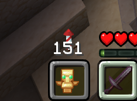

# MiddleClickGUI

A GUI element that shows what your middle click will do, and its item count.

## Features
* Customizable enabled and disabled items.
* Displays item count for the item that will be middle-clicked.
* Configurable HUD position and scale.

